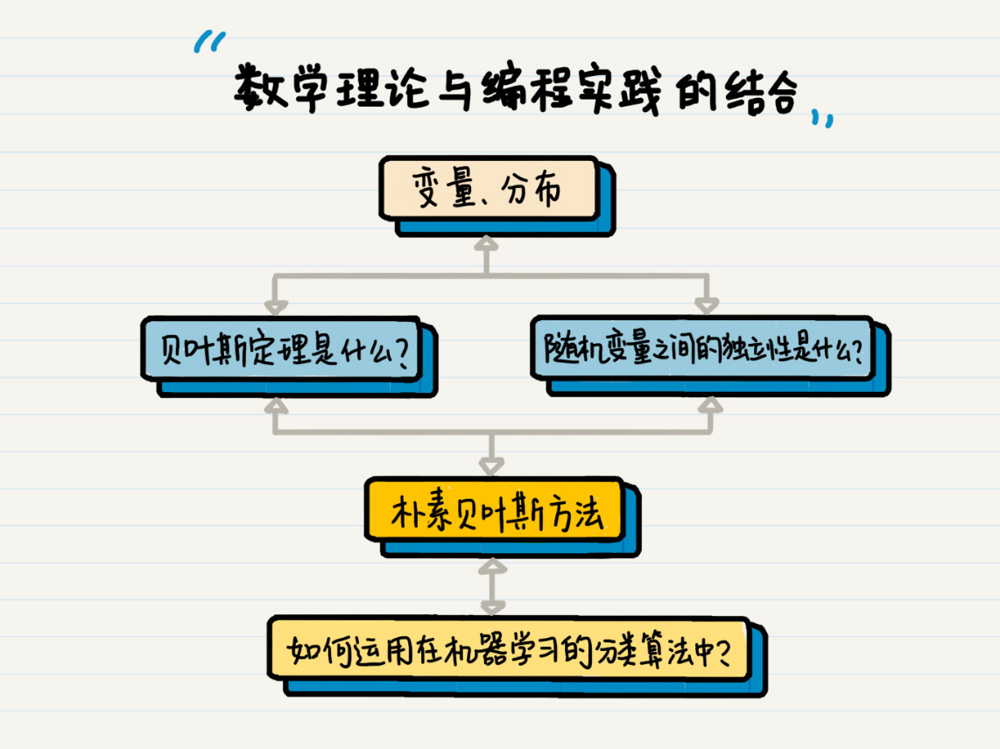

开篇词 | 作为程序员，为什么你应该学好数学？
===

> 对于数学和计算机编程的联系，我之前也没有思考过。直到有一次，在硅谷的一个技术交流Meetup上，我听到一位嘉宾分享说：“如果你只想当一个普通的程序员，那么数学对你来说，并不重要。但是如果你想做一个顶级程序员，梦想着改变世界，那么数学对你来说就很重要了。”

自从做了程序员，你可能早就把数学抛在了脑后，甚至觉得曾经为了应试而“硬学”的数学应该是彻底没什么用了，终于可以和他们 say goodbye 了。毕竟作为一个基础学科，数学肯定是没操作系统、数据结构、计算机网络这样的课程看起来“实用”。

> 我之前就是这么认为的。到后来，我读了硕士，开始接触机器学习，猛然间才发现，机器学习表面上是“写程序”，但实际上剥去外表，本质上就是在研究数学。从那会儿开始，我对数学的认知也才逐步客观和理性起来。

再到现在，我参加了工作，写了这么多年代码，我想说，数学学得好不好，将会直接决定一个程序员有没有发展潜力。因为往大了说，**数学它其实是一种思维模式，考验的是一个人归纳、总结和抽象的能力**。把这个能力放到程序员的世界里，其实就是解决问题的能力。

我觉得，**如果编程语言是血肉，数学的思想和知识就是灵魂。**它可以帮助你选择合适的数据结构和算法、提升系统效率、并且赋予机器智慧。尤其是在大数据和智能化的时代，更是如此。

> 举个例子，比如我们小学就学到的余数，其实在编程的世界里也有很多应用。
> 
> 你经常用到的分页功能，根据记录的总条数和每页展示的条数，最后来计算整体的页数，这里面就会有余数的思想。再难一点，奇偶校验、循环冗余检验、散列函数、密码学等等都有余数相关的知识。

> 遇到这些问题的时候，你能说你不懂余数吗？我想你肯定懂，只是很多时候没有想到可以用余数的思想来解决相关问题罢了。那为什么没有想到呢？我认为，本质原因还是你没有数学思维，还是你数学的基础不够好。

## 专栏思路

首先，我梳理了编程中最常用的数学概念，由浅入深剖析它们的本质，帮你彻底掌握这些最基础、也最核心的数学知识。

> 这其中包括那些你曾经熟悉的数学名词，比如数学归纳法、迭代法、递归、排列、组合等等。

其次，我把线性代数和概率统计中的抽象概念、公式、定理都由内而外地讲了出来，并分析它们在编程中的应用案例，帮助你提升编程的高阶能力。对于这些内容，我会从基本的概念入手，结合生活和工作中的实际案例，让你更轻松地理解概念的含义。

> 比如，对于朴素贝叶斯方法，我会从基本的随机现象、随机变量和概率分布等着手。随后，我会逐步深入，结合这些数学知识在编程算法中的应用进行展开。比方说，贝叶斯定理是什么，随机变量之间的独立性是什么，这些是如何构成朴素贝叶斯方法的，而最终朴素贝叶斯又是如何被运用在机器学习的分类算法之中的。

  
 

不过话又说回来，我认为数学理论和编程实践的结合其实是“决裂”的，所以学习数学的时候，你**不能太功利**，觉得今天学完明天就能用得着，这个学习思路放在数学里绝对不合适。

因为数学知识总是比较抽象，特别是概率统计和线性代数中的概率、数据分布、矩阵、向量等概念。它们真的很不好理解，也需要我们花时间琢磨，但是对于高级一点的程序设计而言，特别是和数据相关的算法，这些概念就非常重要了，这可都是先人总结出来的经验。

如果你能够将这些基本概念和核心理论都搞懂、搞透，那么面对系统框架设计、性能优化、准确率提升这些难题的时候，你就能从更高的角度出发去解决问题，而不只是站在一个“熟练工”的视角，去增删改查。

最后，我希望**数学能够成为你的一种基础能力，希望你能养成用数学思维来分析问题和解决问题的习惯**。如果你对数学有更好的理解，遇到问题的时候就能追本溯源，快、准、稳地找到解决方案。

> 伽利略曾经说过，“宇宙这本书是用数学语言写成的”，数学是人类科学进步的重要基础，所以，你我都要怀着敬畏的心态去学习、思考数学。同样，我还要求我自己的孩子一定要学好数学，因为我确信，这对于他未来的发展来说，至关重要。

编程的世界远不止条件和循环语句，程序员的人生应当是创造的舞台。我希望通过这个专栏的学习，能够让你切实感受到数学这个古老学科的活力和魅力。